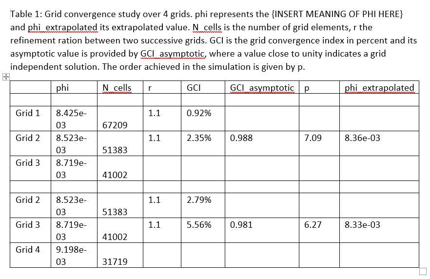

[](https://pypi.python.org/pypi/pygcs/)
[](https://shields.io/)
[](https://www.python.org/)

# Table of Contents
1. [Introduction](#1-introduction)
2. [Installation](#2-installation)
3. [Usage](#3-usage)
4. [Examples](#4-examples)

    4.1 [Output GCI study into Markdown table (constant volume)](#41-output-gci-study-into-markdown-table-constant-volume)

    4.2 [Output GCI study into LaTeX table (variable volume)](#42-output-gci-study-into-latex-table-variable-volume)

    4.3 [Output GCI study into a MS word table (representative grid size based)](#43-output-gci-study-into-a-ms-word-table-representative-grid-size-based)

    4.4 [Using more than 3 grids](#44-using-more-than-3-grids)

    4.5 [Working with the low-level GCI class](#45-working-with-the-low-level-gci-class)

5. [References](#5-references)

# [1. Introduction](#)

pyGCS (Grid Convergence Study) is a python package that calculates the Grid Convergence Index (GCI), which quantifies the influence a computational mesh has on the solution accuracy which is obtained through numerical analysis. It can be used to establish the error-band of the solution with respect to the numerical grid. This package implements the equations presented in [1] and [2].

# [2. Installation](#)

To install pyCGS through pip, run the following command

```bash
pip3 install pycgs
```

If you prefer downloading the source directly through github, use

```bash
git clone git@github.com:tomrobin-teschner/pyGCS.git
```

to download the source through SSH or

```bash
git clone https://github.com/tomrobin-teschner/pyGCS.git
```

to download the source through https.

# [3. Usage](#)

The following shows how to calculate the GCI and get additional information that may be useful to establish grid independence.

There are two ways to obtain the GCI, a high-level and a low-level API. Both expect the same input but provide different output. The high-level output is provided in form of text that can be directly processed by common word processing tools such as Markdown, LaTeX and MS word, while the low-level API provides access to all GCI relevant parameters should a custom output be required. The representative classes are:
- high-level class: ```GCS()``` (i.e. grid convergence study) - Use this class if you want to process your simulations and get a pretty output of your results. This class calls the GCI class internally. It allows you to have more than 3 grids levels and will perform a separate GCI study for 3 successively refined grids and output that into the table output.
- low-level class: ```GCI()``` (i.e. grid convergence index) - While the GCS class provides access to the most useful GCI parameters, such as the GCI, asymptotic GCI, apparent order and extrapolated values, the GCI class is lower level ande provides you to all of its internally calculated parameters, but doesn't provide pretty outputting, rather you only get access through getter functions. However, you can also dynamically change the internal data at runtime through setter functions which may be useful if you want to include a GCI calculation in your custom toolchain. Unlike the ```GCS``` class, the ```GCI``` class only works on 3 grid levels, if more grid levels are required, separate objects need to be instantiated from the ```GCI``` class (or the content of the object(s) have to be dynamically changed through the setters).

The following variables must be provided to either the high- or low-level classes' constructors:
- ```'cells'```: The number of cells used for each grid that is considered in the GCI calculation. It needs to be provided as a python list such as ```cells=[100, 200, 400]```.
- ```'solution'```: The solution list which was obtained on the different grids. It needs to be ordered in the same way as the ```cells``` list, i.e. if the first index in the ```cells``` list corresponds to the smallest grid, then the first index in the ```solution``` list must have been obtained on that same grid. It's format is identical to the ```cells``` list, e.g. ```solution=[1.8, 1.83, 1.84]```
gcs_with_grid_size = pyGCS.GCI(dimension=2, simulation_order=2, grid_size=[0.75, 1.125, 1.5],
- *Representative grid size*: We need to associate some form of representative grid size to each grid. We can either specify that directly through a list, e.g. ```grid_size=[0.8, 0.4, 0.2]```, which could be, for example, the spacing of equidistant cells in a 1D / 2D / 3D grid. Most commonly, though, we can not specify such as parameter easily for complex (unstructured) meshes, thus we want to calculate a representative grid size. We do that by specifying the domain's area (2D) or volume (3D) which will then be used, together with the number of cells, to approximate a representative grid size. The area / volume of the domain can be either constant (the domain's shape remains unchanged for all simulations) and be provided as a scalar, e.g. ```volume=122.8``` or as a list, e.g. ```volume=[80.2, 110.6, 147.7]```, which is useful if the domain changes itself as a parameter of the grid convergence stuydies (e.g. when farfield boundary placement is investigated and its influence on the solution).

The following may be provided to both classes' constructors. If nothing is specified, default values will be set:
- ```dimension```: Specify the dimension of the simulation (i.e. 2 or 3). Will default to 3 (i.e. a 3D simulation) if nothing is specified.
- ```simulation_order```: The order used in the simulation. Defaults to 2 (i.e. second-order) if nothing is specified. This parameter is used to initialise the ```apparent_order``` (which in turn is iteratively calculated), which is an indicator of the actual order achieved in the simulation. May yield inaccurate values if the refinement ratio (i.e. the refinement of two successive grids) is too low.

# [4. Examples](#)

## [4.1. Output GCI study into Markdown table (constant volume)](#)

```python
from pyGCS import GCS

# create a grid convergence study object based on a constant domain volume
gcs = GCS(dimension=2, simulation_order=2, volume=76, cells=[18000, 8000, 4500], solution=[6.063, 5.972, 5.863])

# output information to Markdown-formated table
gcs.print_table(output_type='markdown', output_path='.')
```

The constructor takes the arguments as explained in the [usage](#usage) section. In this case, the domain has a constant ```volume``` and thus we only provide a scalar value for it. We set ```dimension=2```, indicating a 2D simulation and provide the required input for ```solution``` and ```cells``` as explained.

Once we have have valid ```GCS()``` object (here ```gcs```), we can call the ```print_table(object_type='markdown', output_path'.')``` on it, which will generate a Markdown-styled textfile called ```table.md``` in the current ('.') directory.

The content of ```table.md``` is given in the following:

*Table 1: Grid convergence study over 3 grids. phi represents the {INSERT MEANING OF PHI HERE} and phi_extrapolated its extrapolated value. N_cells is the number of grid elements, r the refinement ration between two successive grids. GCI is the grid convergence index in percent and its asymptotic value is provided by GCI_asymptotic, where a value close to unity indicates a grid independent solution. The order achieved in the simulation is given by p.*

|        |  phi      |   N_cells   |  r  |  GCI  | GCI_asymptotic |  p   | phi_extrapolated |
|--------|:---------:|:-----------:|:---:|:-----:|:--------------:|:----:|:----------------:|
|        |           |             |     |       |                |      |                  |
| Grid 1 | 6.063e+00 |       18000 | 1.5 | 2.17% |                |      |                  |
| Grid 2 | 5.972e+00 |        8000 | 1.3 | 4.11% |      1.015     | 1.53 |     6.17e+00     |
| Grid 3 | 5.863e+00 |        4500 | -   | -     |                |      |                  |
|        |           |             |     |       |                |      |                  |

## [4.2. Output GCI study into LaTeX table (variable volume)](#)

We proceed in a similar fashing as above but change the ```output_type='latex'``` so that we have:

```python
from pyGCS import GCS

# create a grid convergence study object based on a constant domain volume (provided as a list)
gcs = GCS(dimension=2, simulation_order=2, volume=[76, 76, 76], cells=[18000, 8000, 4500], solution=[6.063, 5.972, 5.863])

# output information to Markdown-formated table
gcs.print_table(output_type='latex', output_path='.')
```
To show that we can also work with a list of volumes (even though here they are constant), we have changed the input for ```volume``` to be a list of constant entries. Using the above code will generate a file called ```table.tex``` in the current directory which we can either copy and paste into our LaTeX document or include directly through the \input command. The following shows a minimalistic LaTeX source file on how to include the table (assuming the table is in the same directory as the LaTeX file)

```latex
\documentclass[12pt]{article}
\usepackage{amsmath}
\usepackage{graphicx}
\usepackage[latin1]{inputenc}
\usepackage{booktabs}
\usepackage{multirow}

\begin{document}

\input{table}

\end{document}
```

This will produce the following table:


## [4.3 Output GCI study into a MS word table (representative grid size based)](#)

Getting output for MS word requires a bit more copy and paaste action from the user but can be just as easily done. We replace again the ```output_type='word'``` variable and have:

```python
from pyGCS import GCS

# create a grid convergence study object based on a representative grid size
gcs = GCS(dimension=2, simulation_order=2, grid_size=[0.75, 1.125, 1.5], cells=[18000, 8000, 4500], solution=[6.063, 5.972, 5.863])

# output information to Markdown-formated table
gcs.print_table(output_type='word', output_path='.')
```
Again, to show that we can work with a representative grid size (for example, a constant spacing in the x direction, i.e. delta x), we can impose the ```grid_size``` directly. The above code will generate a ```table.txt``` file in the current directory which includes the table itself and instructions on how to copy and paste it into MS word. The output is given below:

```
Generate an empty table in word with dimensions 8 (columns) x 5 (rows), select all cells and copy the content after the caption below into the table

Table 1: Grid convergence study over 3 grids. phi represents the {INSERT MEANING OF PHI HERE} and phi_extrapolated its extrapolated value. N_cells is the number of grid elements, r the refinement ration between two successive grids. GCI is the grid convergence index in percent and its asymptotic value is provided by GCI_asymptotic, where a value close to unity indicates a grid independent solution. The order achieved in the simulation is given by p.

	phi	N_cells	r	GCI	GCI_asymptotic	p	phi_extrapolated

Grid 1	6.063e+00	      18000	1.5	2.17%			
Grid 2	5.972e+00	       8000	1.3	4.11% 	1.015	1.53	6.17e+00
Grid 3	5.863e+00	       4500					
```

After generating a table of dimensions 8 x 5, we select all cells in the table and copy the above content into it. All entries are separated by tabs which MS word will interpret as separators so make sure to copy all tabs. After doing so, we get the following output in MS word:


At this point, you may want to improve the styling to your liking and potentially remove phi with the greek letter phi, etc.

## [4.4 Using more than 3 grids](#)

When working with more than 3 grid levels, we have to compute separate GCIs for the different grid levels. For example, if we have 4 grids, we need to split the input into 2 separate GCI calculations, each of which will provide their own GCI value, asymptotic GCI value, extrapolated value of the solution variable and apparent order. In ```pyGCS```, this is handled within the ```GCS``` class automatically and we can simply provide any list which has 3 or more entries for the ```solution``` and ```cells``` list (potentially also ```volume``` if provided as a list rather than a scalar). The example below shows the calculation of the GCI for 4 grid levels, here the calculation of the drag coefficient for 4 different airfoil grids.

```python
from pyGCS import GCS


# create a grid convergence study object based on a constant domain volume
gcs = GCS(dimension=2, simulation_order=2, volume=456.745,
          cells=[31719, 41002, 51383, 67209],
          solution=[0.00919801, 0.00871879, 0.00852288, 0.00842471])

# output information to LaTeX-formated table
gcs.print_table(output_type='latex', output_path='.')

# output information to Markdown-formated table
gcs.print_table(output_type='markdown', output_path='.')

# output information to MS word-formated table
gcs.print_table(output_type='word', output_path='.')
```

This will generate the following outputs:
- Markdown:

|        |  phi      |   N_cells   |  r  |  GCI  | GCI_asymptotic |  p   | phi_extrapolated |
|--------|:---------:|:-----------:|:---:|:-----:|:--------------:|:----:|:----------------:|
|        |           |             |     |       |                |      |                  |
| Grid 1 | 8.425e-03 |       67209 | 1.1 | 0.92% |                |      |                  |
| Grid 2 | 8.523e-03 |       51383 | 1.1 | 2.35% |      0.988     | 7.09 |     8.36e-03     |
| Grid 3 | 8.719e-03 |       41002 | -   | -     |                |      |                  |
|        |           |             |     |       |                |      |                  |
| Grid 2 | 8.523e-03 |       51383 | 1.1 | 2.79% |                |      |                  |
| Grid 3 | 8.719e-03 |       41002 | 1.1 | 5.56% |      0.981     | 6.27 |     8.33e-03     |
| Grid 4 | 9.198e-03 |       31719 | -   | -     |                |      |                  |
|        |           |             |     |       |                |      |                  |

- LaTeX:


- MS word:



## [4.5 Working with the low-level GCI class](#)

If we instead want to directly access to GCI calculation and its parameters in a raw format, we need to use the ```GCI``` class instead, whose constructor takes the same arguments as the ```GCS``` class. This may be useful as alluded to above when the GCI calculation should be included into a custom toolchain where these parameters may be used to automatically construct computational grids of if we quickly want to get values interactively thorugh a python shell. Consider the following python shell session below:

```python
>>> from pyGCS import GCI
>>> gci = GCI(dimension=2, simulation_order=2, volume=76,
...           cells=[18000, 8000, 4500],
...           solution=[6.063, 5.972, 5.863])
>>> # get the GCI values for the current object
... gci.get('gci')
[0.02174986947064777, 0.041128508661699106]
>>>
>>> # get the volume we specified in the constructor
... gci.get('volume')
76
>>>
>>> # set the volume to a list, instead of a scalar value
... gci.set('volume', [76,76,76])
>>>
>>> # inspect the volume again (now we have a list rather than a scalar value)
... gci.get('volume')
(76, 76, 76)
>>>
>>> # re-calculate the GCI values again (which have not changed)
... gci.get('gci')
[0.02174986947064777, 0.041128508661699106]
>>>
>>> # get the asymptotic GCI value (a value close to 1 indicates grid independence)
... gci.get('asymptotic_gci')
1.0152377561479444
>>>
>>> # get the order we achieved in this simulation
... gci.get('apparent_order')
1.5339690796314442
>>>
>>> # get the refinement ratio
... gci.get('refinement_ratio')
[1.5, 1.3333333333333335]
>>>
>>> # in addition, we can query the GCI object for how many cells we may need
... # for a specific GCI value
... # Here, how many cells do we need for a GCI value of 0.01 (1%)?
... gci.get_number_of_cells_for_specified_gci_of(0.01)
29871.82256317085
>>>
>>> # and what about a GCI value of 0.001 (0.1%)
... gci.get_number_of_cells_for_specified_gci_of(0.001)
134018.6823014075
```

All properties which have a getter can also be set dynamically. The following list provides the keywords which can be used in getter and setter functions, i.e. ```gci.get(key)``` and ```gci.set(key, value)```. Everytime the setter is called, the internal state of the gci object is set to out-of-date so that when we call ```gci.get('gci')```, a new GCI calculation will be performed, taking the newly set parameters into account.

- ```safety_factor```: Safety factor used in GCI calculation, i.e. 1.25 or 3.0 (set automatically based on input).
- ```simulation_order```: The order used in the simulation (e.g. 2 for second-order)
- ```apparent_order```: This is the actual order achieved in the simulation and may be different from the ```simulation_order```. This value is obtained iteratively and calculated automatically.
- ```dimension```: The dimension of the simulted domain (e.g. 2 for a 2D domain)
- ```gci_up_to_date```: Flag indicated whether the gci needs to be recomputed if a call to gci.get('gci') is made. This flag is automatically updated and does not need to be set externally but may be inspected to see if the GCi object is out-of-date or not.
- ```solution```: A list of the solution varliabes, see [usage](#usage)
- ```volume```: Either a scalar or list of volumes representing the size of the domain. Used for both 2D and 3D simulations.
- ```grid_size```: The representative grid size used to calculate the GCI. Should only be set if the mesh is equidistant in all directions, otherwise the volume information is more appropriate.
- ```cells```: A list of the number of cells used for each computational grid.
- ```refinement_ratio```: Automatically calculated. This ratio defines by how much the grid size has changed from one grid to another.
- ```relative_error```: The relative error made going from one grid to another. Use with care. A small refinement ratio (i.e. two grids which have a similar number og cells) can make the relative error arbitrarily small. Using the GCI value instead provides a more robust measure by how much the error has diminished.
- ```extrapolated_value```: The extrapolated value of the solution, i.e. the values specified in the ```solution``` list that would be obtained for a grid without any mesh induced errors (GCI value going towards 0).
- ```gci```: The GCI value itself. Will always contain Ncells - 1 elements, where the first entry is the GCI calculated from the fine to the medium grid and the second entry the GCI calculated from the medium to the coarse grid.
- ```asymptotic_gci```: Checks by how far we are away from a grid independent solution. A value of 1 (or close to) indicates grid independence.

# [5. References](#)

1. Celik et al. "Procedure of Estimation and Reporting of Uncertainty Due to Discretization in CFD Applications", _Journal of Fluids Engineering_, 130(**7**), 2008  
2. https://www.grc.nasa.gov/www/wind/valid/tutorial/spatconv.html
